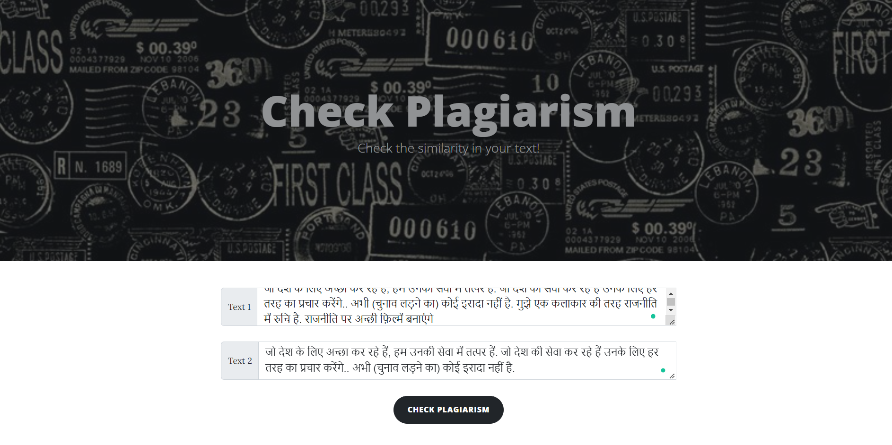
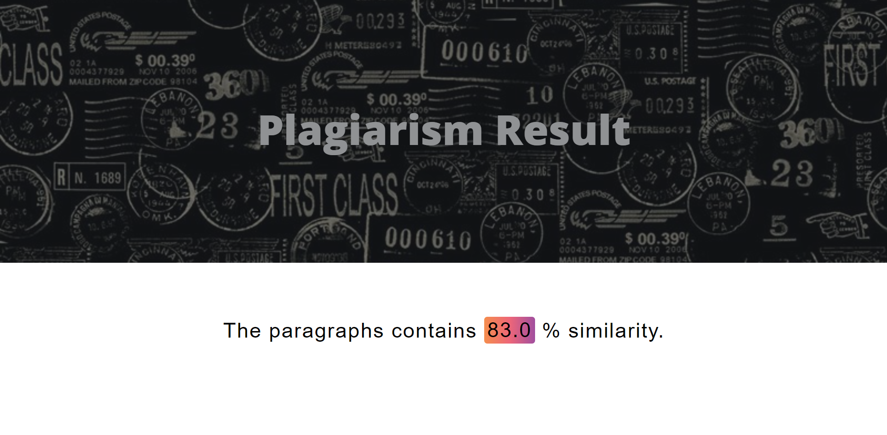

# Plagiarism-in-Hindi
An Application to check plagiarism in Hindi

# blog-with-users-end

<h6>• Blogs Web Application that includes CRUD operation . 
• Made using Flask. 
</h6> 

<h1>Getting Started</h1>

These instructions will get you a copy of the project up and running on your local machine for development and testing purposes.

<h2>Installing</h2>
<pre>Open terminal and type</pre>
<code>git clone https://github.com/orvil1026/Plagiarism-in-Hindi.git </code>  

<h4>or simply download using the url below</h4>
<code> https://github.com/orvil1026/Plagiarism-in-Hindi/archive/refs/heads/master.zip </code> 

<h2>To Install project requrirements </h2>
<code>pip install -r requirements.txt</code>
 

<h2>Set flask_app.py as FLASK_APP </h2>

<code>
set FLASK_APP=flask_app.py</code>
 
<code>$env:FLASK_APP = "flask_app.py"
</code>

<h2> To run the program in local server use the following command </h2>
<code>flask run</code>

<h2>Output </h2>

